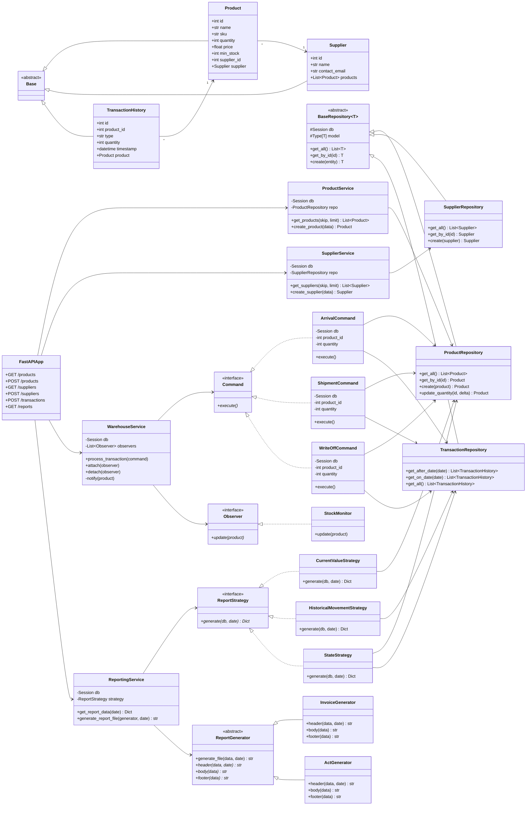

# UML Class Diagram

```mermaid
classDiagram
    direction LR
    %% Models Layer
    class Base {
        <<abstract>>
    }
    
    class Product {
        +int id
        +str name
        +str sku
        +int quantity
        +float price
        +int min_stock
        +int supplier_id
        +Supplier supplier
    }
    
    class Supplier {
        +int id
        +str name
        +str contact_email
        +List~Product~ products
    }
    
    class TransactionHistory {
        +int id
        +int product_id
        +str type
        +int quantity
        +datetime timestamp
        +Product product
    }
    
    Base <|-- Product
    Base <|-- Supplier
    Base <|-- TransactionHistory
    Product "*" --> "1" Supplier
    TransactionHistory "*" --> "1" Product
    
    %% Repository Layer
    class BaseRepository~T~ {
        <<abstract>>
        #Session db
        #Type[T] model
        +get_all() List~T~
        +get_by_id(id) T
        +create(entity) T
    }
    
    class ProductRepository {
        +get_all() List~Product~
        +get_by_id(id) Product
        +create(product) Product
        +update_quantity(id, delta) Product
    }
    
    class SupplierRepository {
        +get_all() List~Supplier~
        +get_by_id(id) Supplier
        +create(supplier) Supplier
    }
    
    class TransactionRepository {
        +get_after_date(date) List~TransactionHistory~
        +get_on_date(date) List~TransactionHistory~
        +get_all() List~TransactionHistory~
    }
    
    BaseRepository <|-- ProductRepository
    BaseRepository <|-- SupplierRepository
    BaseRepository <|-- TransactionRepository
    
    %% Command Pattern
    class Command {
        <<interface>>
        +execute()*
    }
    
    class ArrivalCommand {
        -Session db
        -int product_id
        -int quantity
        +execute()
    }
    
    class ShipmentCommand {
        -Session db
        -int product_id
        -int quantity
        +execute()
    }
    
    class WriteOffCommand {
        -Session db
        -int product_id
        -int quantity
        +execute()
    }
    
    Command <|.. ArrivalCommand
    Command <|.. ShipmentCommand
    Command <|.. WriteOffCommand
    
    ArrivalCommand --> ProductRepository
    ShipmentCommand --> ProductRepository
    WriteOffCommand --> ProductRepository
    ArrivalCommand --> TransactionRepository
    ShipmentCommand --> TransactionRepository
    WriteOffCommand --> TransactionRepository
    
    %% Observer Pattern
    class Observer {
        <<interface>>
        +update(product)*
    }
    
    class StockMonitor {
        +update(product)
    }
    
    Observer <|.. StockMonitor
    
    %% Service Layer
    class ProductService {
        -Session db
        -ProductRepository repo
        +get_products(skip, limit) List~Product~
        +create_product(data) Product
    }
    
    class SupplierService {
        -Session db
        -SupplierRepository repo
        +get_suppliers(skip, limit) List~Supplier~
        +create_supplier(data) Supplier
    }
    
    class WarehouseService {
        -Session db
        -List~Observer~ observers
        +process_transaction(command)
        +attach(observer)
        +detach(observer)
        -notify(product)
    }
    
    class ReportingService {
        -Session db
        -ReportStrategy strategy
        +get_report_data(date) Dict
        +generate_report_file(generator, date) str
    }
    
    ProductService --> ProductRepository
    SupplierService --> SupplierRepository
    WarehouseService --> Command
    WarehouseService --> Observer
    ReportingService --> ReportStrategy
    ReportingService --> ReportGenerator
    
    %% Strategy Pattern
    class ReportStrategy {
        <<interface>>
        +generate(db, date)* Dict
    }
    
    class CurrentValueStrategy {
        +generate(db, date) Dict
    }
    
    class HistoricalMovementStrategy {
        +generate(db, date) Dict
    }
    
    class StateStrategy {
        +generate(db, date) Dict
    }
    
    ReportStrategy <|.. CurrentValueStrategy
    ReportStrategy <|.. HistoricalMovementStrategy
    ReportStrategy <|.. StateStrategy
    
    CurrentValueStrategy --> ProductRepository
    HistoricalMovementStrategy --> TransactionRepository
    StateStrategy --> ProductRepository
    StateStrategy --> TransactionRepository
    
    %% Template Method Pattern
    class ReportGenerator {
        <<abstract>>
        +generate_file(data, date) str
        +header(data, date)* str
        +body(data)* str
        +footer(data)* str
    }
    
    class InvoiceGenerator {
        +header(data, date) str
        +body(data) str
        +footer(data) str
    }
    
    class ActGenerator {
        +header(data, date) str
        +body(data) str
        +footer(data) str
    }
    
    ReportGenerator <|-- InvoiceGenerator
    ReportGenerator <|-- ActGenerator
    
    %% API Layer
    class FastAPIApp {
        +GET /products
        +POST /products
        +GET /suppliers
        +POST /suppliers
        +POST /transactions
        +GET /reports
    }
    
    FastAPIApp --> ProductService
    FastAPIApp --> SupplierService
    FastAPIApp --> WarehouseService
    FastAPIApp --> ReportingService
```
