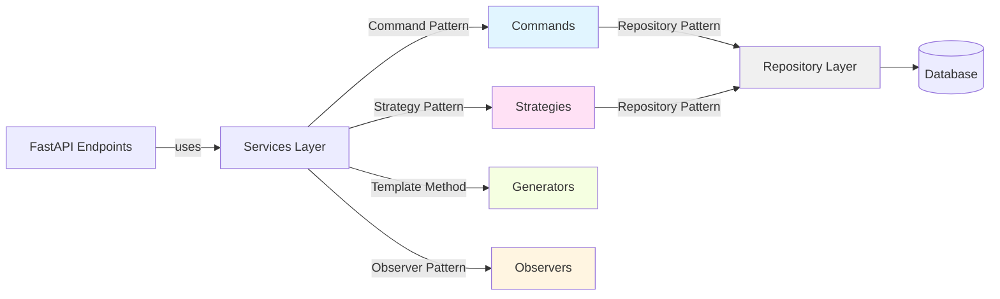

# Design Patterns Summary

## Overview
The Warehouse Management System implements 5 classic design patterns to ensure maintainability, extensibility, and separation of concerns.

---

## 1. Repository Pattern

### Purpose
Abstract data access logic and provide a collection-like interface for domain objects.

### Implementation
- **Base Class**: `BaseRepository<T>` - Generic CRUD operations
- **Concrete Classes**:
  - `ProductRepository` - Product-specific queries
  - `SupplierRepository` - Supplier-specific queries
  - `TransactionRepository` - Transaction queries with temporal filtering

### Benefits
- Decouples business logic from data access
- Centralizes data access logic
- Easy to mock for testing
- Supports database migration without affecting business layer

### Example
```python
class ProductRepository(BaseRepository[Product]):
    def update_quantity(self, product_id: int, delta: int) -> Product:
        product = self.get_by_id(product_id)
        product.quantity += delta
        self.db.commit()
        return product
```

---

## 2. Command Pattern

### Purpose
Encapsulate inventory transaction operations as objects, enabling parameterization and queuing.

### Implementation
- **Interface**: `Command` with `execute()` method
- **Concrete Commands**:
  - `ArrivalCommand` - Handles incoming stock
  - `ShipmentCommand` - Handles outgoing stock
  - `WriteOffCommand` - Handles inventory write-offs

### Benefits
- Decouples sender from receiver
- Supports undo/redo operations
- Enables transaction logging
- Facilitates command queuing and batching

### Example
```python
class ArrivalCommand(Command):
    def execute(self):
        # Update product quantity
        # Log transaction to history
        # Notify observers
```

---

## 3. Observer Pattern

### Purpose
Automatically notify interested parties when inventory levels change.

### Implementation
- **Subject**: `WarehouseService` maintains list of observers
- **Observer**: `StockMonitor` watches for low stock conditions
- **Notification**: Triggered after each transaction

### Benefits
- Loose coupling between warehouse service and monitoring
- Easy to add new observers without modifying core logic
- Real-time alerting for critical stock levels

### Example
```python
class StockMonitor(Observer):
    def update(self, product: Product):
        if product.quantity < product.min_stock:
            print(f"ALERT: {product.name} is below minimum stock!")
```

---

## 4. Strategy Pattern

### Purpose
Define a family of report algorithms and make them interchangeable.

### Implementation
- **Interface**: `ReportStrategy` with `generate()` method
- **Concrete Strategies**:
  - `CurrentValueStrategy` - Current inventory valuation
  - `HistoricalMovementStrategy` - Transaction history for a date
  - `StateStrategy` - Inventory state at a specific date (time-travel)

### Benefits
- Runtime algorithm selection
- Easy to add new report types
- Clean separation of report logic
- Testable in isolation

### Example
```python
service = ReportingService(db, StateStrategy())
report = service.get_report_data(date(2026, 1, 5))
```

---

## 5. Template Method Pattern

### Purpose
Define the skeleton of document generation while allowing subclasses to customize specific sections.

### Implementation
- **Abstract Class**: `ReportGenerator` defines structure
  - `generate_file()` - Template method (fixed algorithm)
  - `header()`, `body()`, `footer()` - Abstract methods (variable parts)
- **Concrete Classes**:
  - `InvoiceGenerator` - Professional invoice HTML
  - `ActGenerator` - Official inspection act HTML

### Benefits
- Code reuse for common HTML structure
- Enforces consistent document format
- Easy to add new document types
- Shared CSS and print functionality

### Example
```python
class ReportGenerator(ABC):
    def generate_file(self, data, date) -> str:
        return f"""
        <html>
            {self.header(data, date)}
            {self.body(data)}
            {self.footer(data)}
        </html>
        """
```

---

## Pattern Interaction Diagram



---

## Best Practices Demonstrated

1. **SOLID Principles**
   - Single Responsibility: Each class has one reason to change
   - Open/Closed: Open for extension, closed for modification
   - Dependency Inversion: Depend on abstractions, not concretions

2. **Clean Architecture**
   - Clear separation of concerns
   - Dependency direction: UI → Service → Repository → Database

3. **Testability**
   - All patterns facilitate unit testing
   - Easy to mock dependencies
   - Isolated business logic
