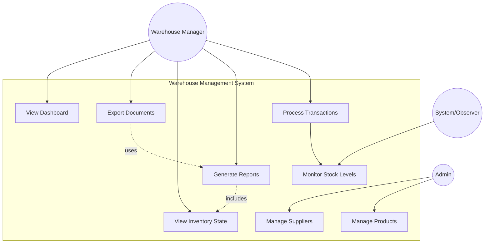

# Use Case Diagram

```mermaid
graph TB
    subgraph "Warehouse Management System"
        UC1[Manage Products]
        UC2[Manage Suppliers]
        UC3[Process Transactions]
        UC4[Generate Reports]
        UC5[Monitor Stock Levels]
        UC6[View Inventory State]
        UC7[Export Documents]
        UC8[View Dashboard]
    end
    
    Admin((Admin))
    Manager((Warehouse Manager))
    System((System/Observer))
    
    Admin --> UC1
    Admin --> UC2
    
    Manager --> UC3
    Manager --> UC4
    Manager --> UC6
    Manager --> UC7
    Manager --> UC8
    
    UC3 --> UC5
    System --> UC5
    
    UC4 -.includes.-> UC6
    UC7 -.uses.-> UC4
```
